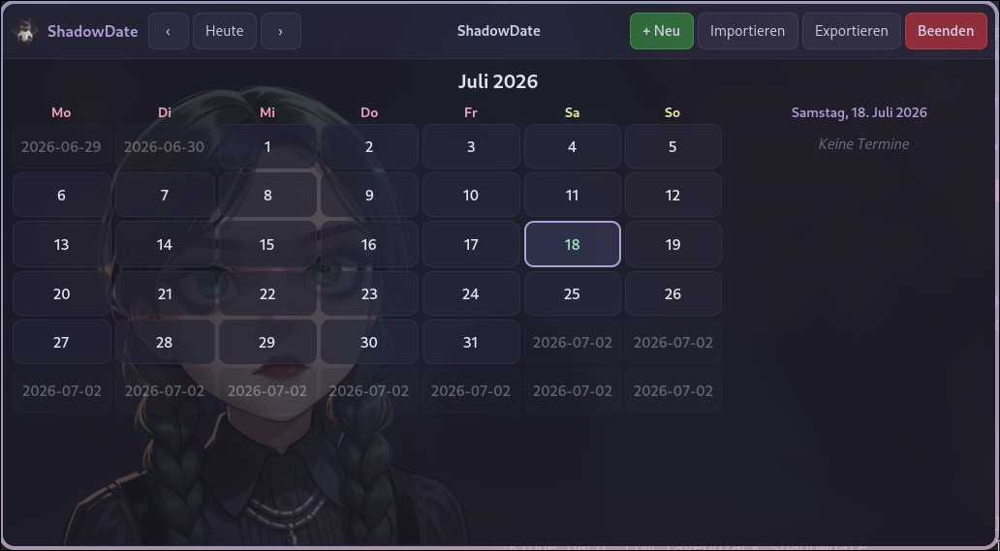

<div align="center">


# 🌙 Shadow Date

### *A gothic, dark-pastel desktop calendar for Linux* 🦇

<br/>


</div>

---

<div align="center">



</div>

---

## 🌸 About

**ShadowDate** is a native **Rust + GTK4** desktop calendar with a moody dark-pastel
soul. It keeps your appointments in a single **iCalendar (`.ics`)** file — which is
*also* the on-disk format *and* the export format — so what you see is exactly what
you share. 💜

> *Elegant month grids, soft pastel accents, and a translucent muse watching over
> your schedule.* ✨

---

## ✨ Features

| | |
|---|---|
| 🗓️ **Month view** | Clean 6-row grid with color-coded appointment chips |
| 📝 **Create / edit / delete** | A polished, scroll-free appointment form |
| 📥 **Import** | Merge any `.ics` file into your calendar by UID |
| 📤 **Export** | Write your whole calendar back out to `.ics` |
| 🎨 **Dark pastel theme** | Lavender, mint, peach, pink, sky & lilac on charcoal |
| 🖼️ **Fancy backdrop** | A translucent portrait sits softly behind the grid |
| 📱 **Responsive** | Two-pane layout that stacks vertically on narrow windows |
| 🌍 **Multilingual** | 🇬🇧 🇩🇪 🇫🇷 🇪🇸 🇨🇳 🇯🇵 🇵🇱 — follows your system locale |

---

## 🌐 Languages

ShadowDate speaks **7 languages**, auto-detected from `LANG` / `LC_ALL` / `LC_MESSAGES`:

🇬🇧 English · 🇩🇪 Deutsch · 🇫🇷 Français · 🇪🇸 Español · 🇨🇳 中文 · 🇯🇵 日本語 · 🇵🇱 Polski

```bash
# Force a language for one run:
LANG=de_DE.UTF-8 shadowdate
```

---

## 🎨 The Palette

<div align="center">

| Color | Hex | Vibe |
|:-----:|:---:|:----:|
| 🟣 Lavender | `#b39ddb` | primary accent |
| 🟢 Mint | `#a0e7c0` | today |
| 🟠 Peach | `#f6c79b` | warm chips |
| 🌸 Pink | `#f4a3c0` | weekdays |
| 🔵 Sky | `#a7c7e7` | cool chips |
| 💜 Lilac | `#c7b6e8` | soft highlights |
| ⚫ Charcoal | `#1b1b26` | the shadow itself |

</div>

---

## 🚀 Build & Run

```bash
# 🛠️  Build (release)
cargo build --release

# 🌙  Run
./target/release/shadowdate

# 🧪  Test (iCalendar round-trip)
cargo test
```

### 🖥️ Install (desktop entry + icon)

```bash
# Binary → ~/.local/bin
cp target/release/shadowdate ~/.local/bin/

# Desktop entry
cp resources/0xravenblack.shadowdata.desktop ~/.local/share/applications/

# Refresh caches
update-desktop-database ~/.local/share/applications
gtk-update-icon-cache -f ~/.local/share/icons/hicolor
```

---

## 🪟 Hyprland (floating window)

ShadowDate is fixed at **1024 × 560** and looks best floating:

```conf
# ~/.config/hypr/hyprland.conf
windowrulev = float, class:^(0xravenblack\.shadowdata)$
windowrulev = size 1024 560, class:^(0xravenblack\.shadowdata)$windowrule = float, ^0xravenblack\.shadowdata$
```

Then reload: `hyprctl reload` 🔄

---

## 🧱 Project Layout

```
shadowdate/
├── 📦 Cargo.toml          # bin: shadowdate · lib: calendar
├── 🗂️  src/
│   ├── main.rs            # app bootstrap, window, headerbar
│   ├── model.rs           # Appointment + Store
│   ├── io_ics.rs          # .ics parse / serialize / import / export
│   ├── calendar_view.rs   # month grid + day list
│   ├── form_dialog.rs     # create / edit / delete dialog
│   ├── i18n.rs            # 🌍 translations
│   └── images.rs          # embedded logo & portrait
├── 🎨 resources/
│   ├── style.css          # dark pastel theme
│   └── img/               # logo, portrait, screenshot
└── 🧪 tests/ics.rs
```

---

## 💾 Where's my data?

Appointments live in a single iCalendar file:

```
$XDG_DATA_HOME/calendar/calendar.ics
# fallback: ~/.local/share/calendar/calendar.ics
```

---

## 🌷 Credits

<div align="center">

Crafted with 💜 by **opencode** 🤖 — your friendly AI pair-programmer.

*Rust 🦀 · GTK4 · chrono · ical · uuid*

Built for **ravenblack** on Wayland / Hyprland. 🖤

</div>

---

<div align="center">

*"Time flows like shadows — ShadowDate just helps you keep up."* 🌙✨

</div>
