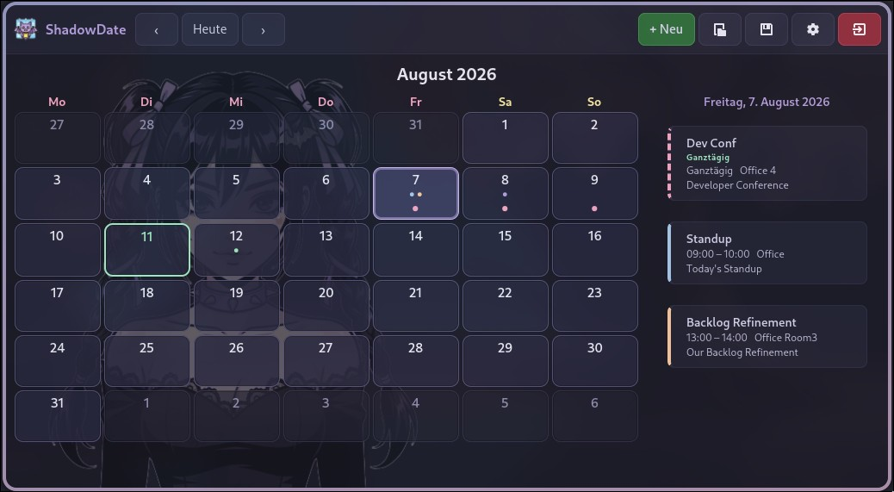

<div align="center">


# 🌙 Shadow Date

### *A gothic, dark-pastel desktop calendar for Linux* 🦇

<br/>


</div>

---

<div align="center">



</div>

---

## 🌸 About

**ShadowDate** is a native **Rust + GTK4** desktop calendar with a moody dark-pastel
soul. It keeps your appointments in a single **iCalendar (`.ics`)** file — which is
*also* the on-disk format *and* the export format — so what you see is exactly what
you share. 💜

> *Elegant month grids, soft pastel accents, and a translucent muse watching over
> your schedule.* ✨

---

## ✨ Features

| | |
|---|---|
| 🗓️ **Month view** | Solid 6×7 grid with compact color-dot indicators per day |
| 📝 **Create / edit / delete** | A polished, scroll-free appointment form |
| 📥 **Import** | Merge any `.ics` file into your calendar by UID |
| 📤 **Export** | Write your whole calendar back out to `.ics` |
| 🎨 **Dark pastel theme** | Lavender, mint, peach, pink, sky & lilac on charcoal |
| 🖼️ **Fancy backdrop** | A translucent portrait sits softly behind the grid |
| ⌨️ **Keyboard-first** | Arrow keys move between days, Enter creates an appointment |
| 🌍 **Multilingual** | 🇬🇧 🇩🇪 🇫🇷 🇪🇸 🇨🇳 🇯🇵 🇵🇱 — follows your system locale |
| 🔔 **Reminders** | Headless systemd-user daemon fires desktop notifications |

---

## 🌐 Languages

ShadowDate speaks **7 languages**, auto-detected from `LANG` / `LC_ALL` / `LC_MESSAGES`:

🇬🇧 English · 🇩🇪 Deutsch · 🇫🇷 Français · 🇪🇸 Español · 🇨🇳 中文 · 🇯🇵 日本語 · 🇵🇱 Polski

```bash
# Force a language for one run:
LANG=de_DE.UTF-8 shadowdate
```

---

## 🎨 The Palette

<div align="center">

| Color | Hex | Vibe |
|:-----:|:---:|:----:|
| 🟣 Lavender | `#b39ddb` | primary accent |
| 🟢 Mint | `#a0e7c0` | today |
| 🟠 Peach | `#f6c79b` | warm chips |
| 🌸 Pink | `#f4a3c0` | weekdays |
| 🔵 Sky | `#a7c7e7` | cool chips |
| 💜 Lilac | `#c7b6e8` | soft highlights |
| ⚫ Charcoal | `#1b1b26` | the shadow itself |

</div>

---

## 🚀 Build & Run

```bash
# 🛠️  Build (release)
cargo build --release

# 🌙  Run
./target/release/shadowdate

# 🧪  Test (iCalendar round-trip)
cargo test
```

### 🖥️ Install (desktop entry + icon)

```bash
# Binary → ~/.local/bin
cp target/release/shadowdate ~/.local/bin/

# Desktop entry
cp 0xravenblack.shadowdata.desktop ~/.local/share/applications/

# Refresh caches
update-desktop-database ~/.local/share/applications
gtk-update-icon-cache -f ~/.local/share/icons/hicolor
```

### 🔔 Reminders (background service)

A tiny headless daemon (`shadowdate-service`) watches the `.ics` store and your
reminder settings, and pops a desktop notification when an appointment is due.
Timed events are announced a few minutes early; all-day events are announced
once, at the morning time you choose.

```bash
# Build both binaries
cargo build --release

# Install the daemon
cp target/release/shadowdate-service ~/.local/bin/

# Start it now and on every login
systemctl --user enable --now shadowdate-service

# ...or manage it from the app: ⚙️ Settings → service section
```

Configure timing in the app (**⚙️ Settings**): the lead time for timed events and
the morning time for all-day events. The daemon reloads
`~/.config/shadowdate/service.toml` live — no restart needed.

---

## 🪟 Hyprland (floating window)

ShadowDate is fixed at **1024 × 560** and looks best floating:

```conf
# ~/.config/hypr/hyprland.conf
windowrulev = float, class:^(0xravenblack\.shadowdata)$
windowrulev = size 1024 560, class:^(0xravenblack\.shadowdata)$windowrule = float, ^0xravenblack\.shadowdata$
```

Then reload: `hyprctl reload` 🔄

---

## 🧱 Project Layout

```
shadowdate/
├── 📦 Cargo.toml          # bins: shadowdate + shadowdate-service · lib: shadowdate
├── 🗂️  src/
│   ├── main.rs            # app bootstrap, window, headerbar
│   ├── model.rs           # Appointment + Store
│   ├── ical_import.rs     # .ics parse / import (RRULE expansion)
│   ├── ical_export.rs     # .ics serialize / export
│   ├── rrule.rs           # RRULE expansion engine
│   ├── store_io.rs        # atomic save / load / backup / merge
│   ├── calendar_view.rs   # month grid + day list
│   ├── form_dialog.rs     # create / edit / delete dialog
│   ├── settings.rs       # ⚙️ app settings dialog (appearance + reminders)
│   ├── i18n.rs            # 🌍 translations
│   ├── images.rs          # embedded logo & portrait
│   ├── paths.rs           # XDG data / config paths
│   ├── config.rs          # app config (reminders + appearance)
│   ├── service.rs         # reminder scheduling + notification (shared)
│   └── bin/
│       └── shadowdate-service.rs  # 🔔 headless reminder daemon
├── 🎨 resources/
│   ├── style.css          # dark pastel theme
│   ├── svg/               # logo + portrait (embedded into the binaries)
│   └── img/               # screenshot (README only)
└── 🧪 tests/
    ├── ics.rs
    ├── config.rs
    └── service.rs
```

---

## 💾 Where's my data?

Appointments live in a single iCalendar file:

```
$XDG_DATA_HOME/calendar/calendar.ics
# fallback: ~/.local/share/calendar/calendar.ics
```

Reminder settings live in:

```
$XDG_CONFIG_HOME/shadowdate/service.toml
# fallback: ~/.config/shadowdate/service.toml
```

---

## 🌷 Credits

<div align="center">

Crafted with 💜 by **opencode** 🤖 — your friendly AI pair-programmer.

*Rust 🦀 · GTK4 · chrono · ical · uuid*

Built for **ravenblack** on Wayland / Hyprland. 🖤

</div>

---

<div align="center">

*"Time flows like shadows — ShadowDate just helps you keep up."* 🌙✨

</div>
